<h3><code>kamran@github \~ $ ./contributions.sh</code></h3>

  

<h3><code>kamran@github \~ $ whoami</code></h3>

<table>
  <tr>
    <td valign="top"></td>
    <td valign="top"></td>
  </tr>
</table>

 

<h3><code>kamran@github \~ $ ls ./links</code></h3>

  

<code>graph auto-refreshes daily via GitHub Actions</code>

